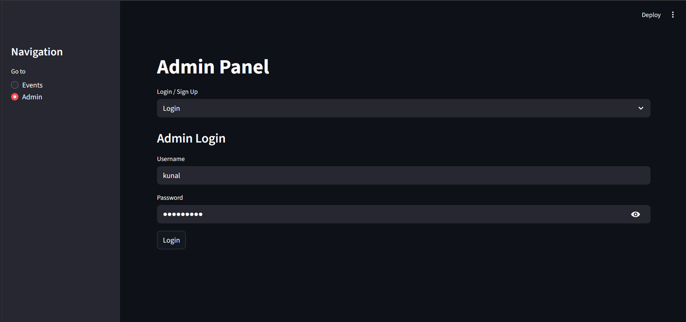
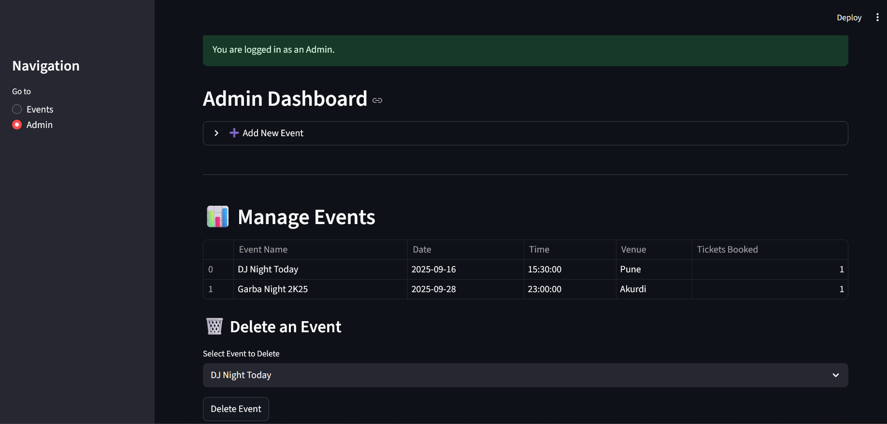
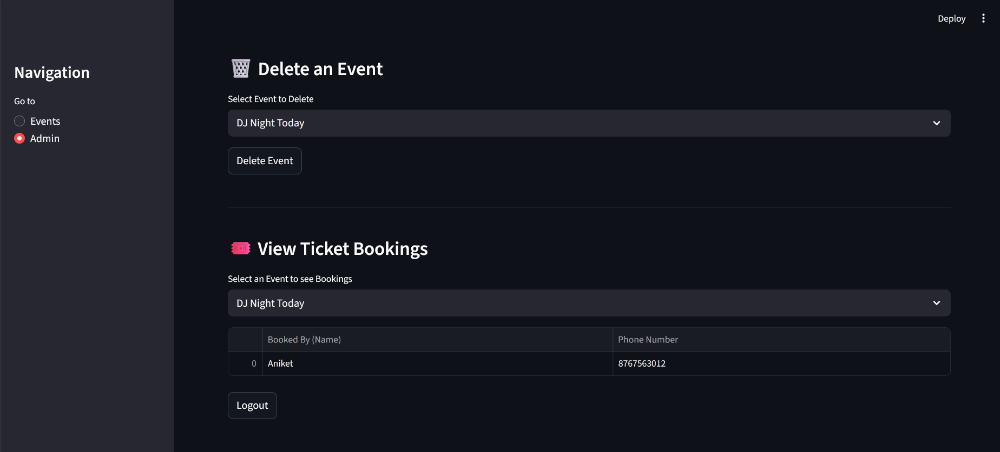
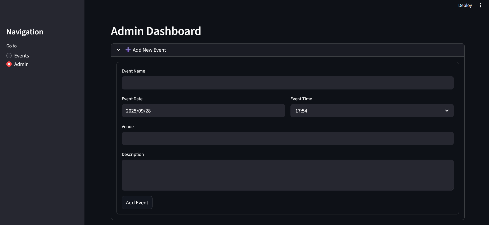

EventPro - Event Ticket Management System

A simple, yet effective web application for managing events and booking tickets, built with Python and Streamlit.
📋 Description

EventPro provides a straightforward interface for both administrators and users. Admins can create, manage, and delete events, as well as view all the bookings for each event. Users can browse the list of upcoming events and book their tickets with ease.

The application uses a local SQLite database to persist all data, making it a self-contained and easy-to-run project.

✨ Features

The application is split into two main sections: a public-facing Events Page and a secure Admin Panel.
User-Facing (Events Page)

    Browse Events: View all upcoming events in a clean, card-based layout.

    View Event Details: See details for each event including date, time, venue, and a description.

    Book Tickets: A simple and intuitive form to book a ticket for any event.

Admin Panel

    Secure Login: Admins have a separate login and signup system. Passwords are securely hashed before being stored.

    Event Management:

        Create Events: Add new events with details like name, date, time, venue, and description.

        Delete Events: Remove events and all associated bookings from the system.

    Dashboard:

        Event Overview: View a table of all events along with a count of how many tickets have been booked for each.

        View Bookings: Select an event to see a detailed list of all attendees and their contact information.

🛠️ Tech Stack

    Backend & Frontend: Python with Streamlit

    Database: SQLite

    Data Handling: Pandas

🚀 Setup and Usage

To run this project locally, follow these steps:
1. Prerequisites

    Python 3.7+ installed on your system.

2. Clone the Repository

git clone [https://github.com/Kunal-kawate/EventPro-Event-Ticket-Management-System.git](https://github.com/Kunal-kawate/EventPro-Event-Ticket-Management-System.git)
cd EventPro-Event-Ticket-Management-System

3. Create a Virtual Environment (Recommended)

# For Windows
python -m venv venv
venv\Scripts\activate

# For macOS/Linux
python3 -m venv venv
source venv/bin/activate

4. Install Dependencies

The required packages are listed in requirements.txt.

pip install -r requirements.txt

5. Run the Application

Once the dependencies are installed, you can start the Streamlit server.

streamlit run main.py

The application should now be open and running in your web browser!
🗃️ Database

Upon running the application for the first time, a ticketManage.db file will be automatically created in the root directory. This file contains all the database tables and data for the application.

This README was generated for a project created by Kunal Kawate.
